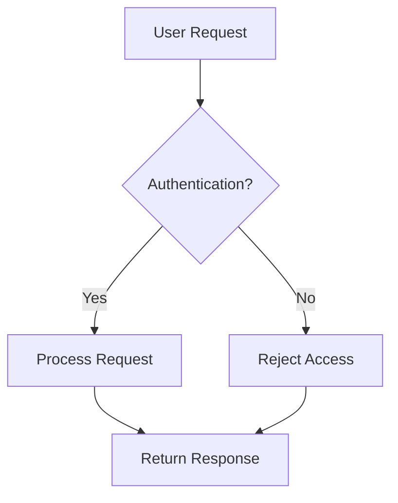
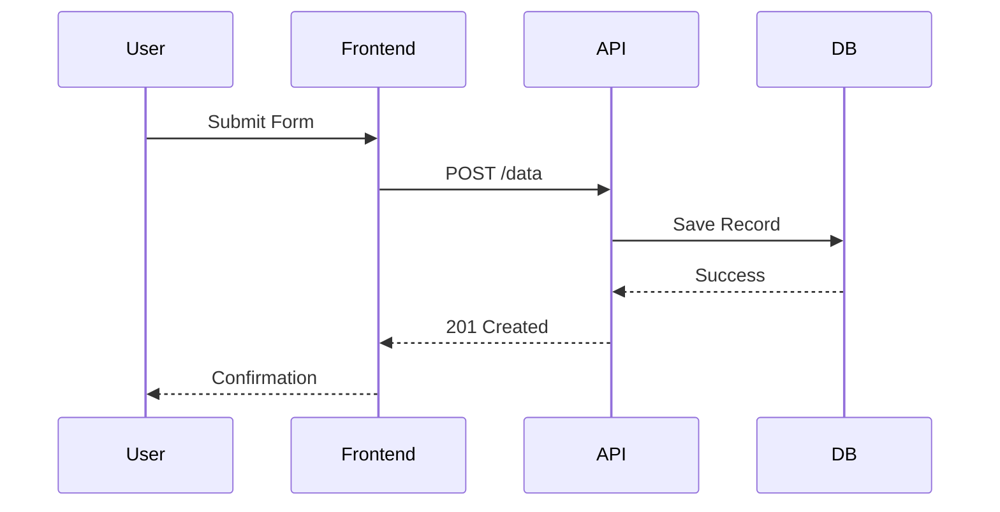
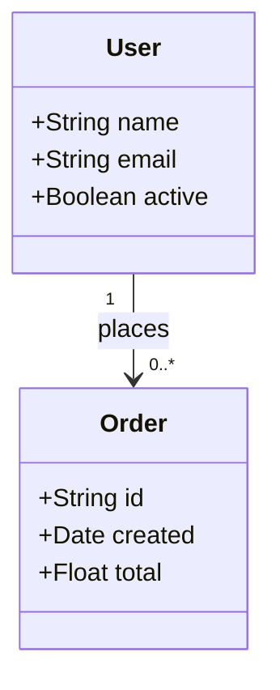
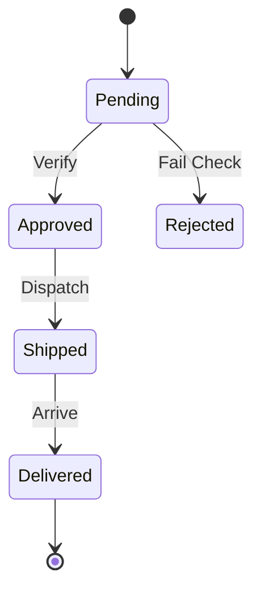
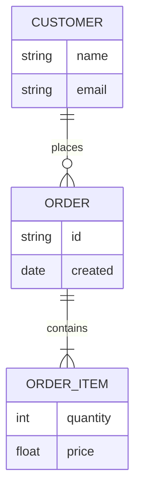
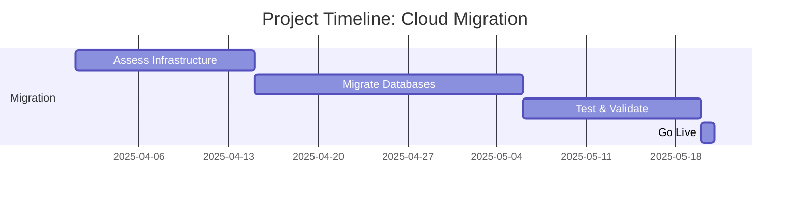
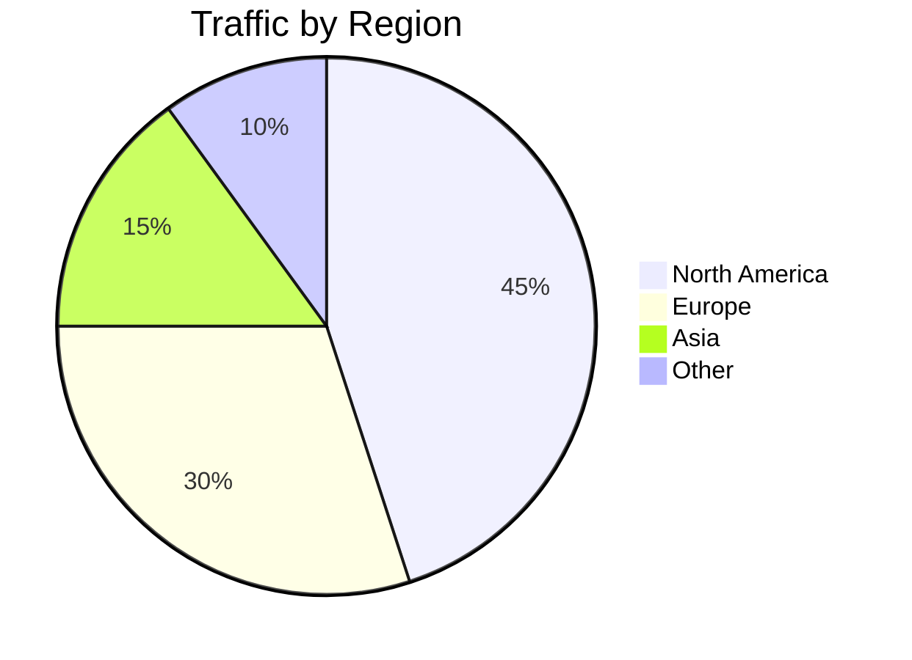
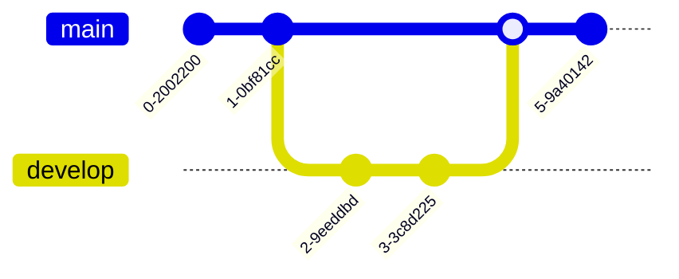
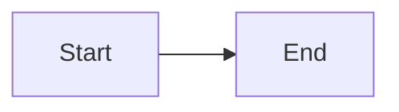

# **Diagrams as Code: Elevating Cloud Architecture with Mermaid.js**

## **Introduction**

As Cloud Engineers and Solutions Architects, we frequently move from problem statements to scalable solutions — using methodologies like the **Rational Unified Process (RUP)**, **Use Case Driven Design**, or **Agile Modeling**. A critical part of this journey is visualizing system architecture.

While tools like **Draw.io**, **Mural**, and **Lucidchart** have served us well, they come with limitations: diagrams become outdated, versioning is hard, and collaboration is siloed.

Enter **Mermaid.js** — a lightweight, open-source library that enables *Diagrams as Code*, perfectly aligning with Infrastructure as Code (IaC) principles.

Let’s explore how Mermaid transforms architectural documentation and how you can start using it today — especially within Markdown and on GitHub.

---

## **Why Mermaid.js?**

Mermaid allows you to define diagrams using simple, readable text syntax. These diagrams are:
- Version-controlled alongside your code
- Collaboratively reviewed via pull requests
- Automatically updated with infrastructure changes
- Rendered natively in Markdown and supported on **GitHub**

This ensures documentation stays accurate, consistent, and maintainable.

---

## **Supported Diagram Types with Practical Examples**

### **1. Flowchart – Visualizing System Workflows**

Ideal for illustrating high-level architecture flows, decision logic, or data pipelines.



> *Use Case:* Show authentication flow in a microservices API gateway.

---

### **2. Sequence Diagram – Service Interactions**

Perfect for detailing real-time interactions between users, frontends, APIs, and backend services.



> *Use Case:* Documenting a user signup process across layers.

---

### **3. Class Diagram – Object Modeling**

Great for modeling domain entities, especially in OOP-based or backend service design.



> *Use Case:* Designing a user-order relationship in an e-commerce system.

---

### **4. State Diagram – State Transitions**

Useful for systems with lifecycle states (e.g., order processing, VM states).



> *Use Case:* Modeling the lifecycle of an order in a logistics system.

---

### **5. Entity Relationship Diagram (ERD) – Database Design**

Helps visualize database schemas and relationships between tables.



> *Use Case:* Documenting schema design for a new database module.

---

### **6. Gantt Chart – Project Planning**

Excellent for tracking milestones, sprints, or cloud migration timelines.



> *Use Case:* Planning and sharing a cloud migration roadmap.

---

### **7. Pie Chart – Data Distribution**

Useful for showing metrics like resource usage, cost distribution, or traffic share.



> *Use Case:* Visualizing regional distribution of application traffic.

---

### **8. Git Graph – Version Control History**

Illustrates branching strategies, CI/CD pipelines, or release workflows.



> *Use Case:* Explaining Git branching model (e.g., Git Flow) in team onboarding.

---

## **How to Use Mermaid in Markdown & on GitHub**

Using Mermaid in Markdown is simple. Just wrap your diagram code in a fenced code block with the `mermaid` language tag:

````markdown

````

### ✅ **GitHub Support**

As of 2023, **GitHub natively supports Mermaid.js** in `.md` files. This means:
- Diagrams render directly in READMEs, ADRs, or issue comments
- No external tools or preprocessing needed
- Full version control and diff tracking

> **Note**: Mermaid must be enabled in your environment. GitHub supports it by default; for local previews, use editors like **VS Code with Mermaid plugin** or **Obsidian**.

---

## **Benefits of Diagrams as Code**

| Benefit | Impact |
|--------|--------|
| **Version Control** | Track diagram changes via Git commits |
| **Collaboration** | Review diagrams in pull requests |
| **Consistency** | Avoid stale screenshots; keep docs in sync |
| **Automation** | Generate diagrams from templates or CI/CD |
| **Accessibility** | Text-based = searchable, editable, screen-reader friendly |
| **Effortless Updates** | When architecture evolves, **update the code and the diagram auto-updates** — no manual redrawing needed. This saves significant time and reduces errors during iterative design changes. |

💡 *Example:* Need to add a new service to your flowchart? Just add one line of Mermaid code — no clicking, dragging, or realigning shapes. The diagram renders perfectly every time.*

---

## **Conclusion**

Mermaid.js is more than a diagramming tool — it’s a paradigm shift in how we document systems. By treating diagrams as code, we align architectural documentation with modern DevOps practices.

Whether you're designing cloud architectures, documenting microservices, or planning migrations, **Mermaid empowers you to build living, versioned, and collaborative diagrams** — right alongside your infrastructure.

And with the ability to **update diagrams simply by editing code**, teams save time, reduce overhead, and maintain accuracy throughout the system lifecycle.

It’s time to evolve from static images to **dynamic, code-driven visuals**.

---
